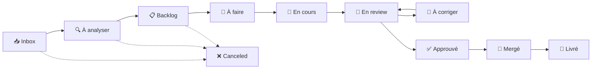

# 📋 Workflow Linear — Guide des Statuts

> Ce document décrit les 10 statuts du workflow Linear utilisés pour le projet Origis.

---

## Vue d'ensemble



---

## Les 10 Statuts

### 📥 Inbox

| | |
|---|---|
| **Définition** | Issue vient d'être créée, pas encore triée |
| **Responsable** | PO (Thomas) |
| **Action** | Trier vers "À analyser" ou fermer si invalide |
| **Durée max** | 24h |
| **Transition** | → À analyser |

---

### 🔍 À analyser

| | |
|---|---|
| **Définition** | Issue acceptée, en attente d'analyse détaillée |
| **Responsable** | PO |
| **Action** | Rédiger l'analyse (critères d'acceptation, tâches, estimation) |
| **Transition** | → Backlog (après analyse complète) |

---

### 📋 Backlog

| | |
|---|---|
| **Définition** | Issue analysée, prête à être planifiée |
| **Responsable** | PO |
| **Action** | Prioriser et assigner à une version quand prioritaire |
| **Transition** | → À faire (assignée à quelqu'un) |

---

### 🎯 À faire

| | |
|---|---|
| **Définition** | Planifiée, prête à être prise |
| **Responsable** | Dev assigné |
| **Action** | Commencer le travail |
| **Transition** | → En cours |

---

### 🔨 En cours

| | |
|---|---|
| **Définition** | Travail en cours de développement |
| **Responsable** | Dev assigné |
| **Action** | Développer, créer la branche, coder |
| **Transition** | → En review (PR ouverte) |

---

### 👀 En review

| | |
|---|---|
| **Définition** | PR ouverte, en attente de review |
| **Responsable** | Reviewer (binôme) |
| **Action** | Relire le code, commenter, approuver ou demander des changements |
| **Transition** | → À corriger OU → Approuvé |

---

### 🔄 À corriger

| | |
|---|---|
| **Définition** | Review faite, des changements sont demandés |
| **Responsable** | Dev assigné |
| **Action** | Appliquer les corrections demandées |
| **Transition** | → En review (après corrections) |

---

### ✅ Approuvé

| | |
|---|---|
| **Définition** | PR approuvée, prête à être mergée |
| **Responsable** | Dev assigné ou PO |
| **Action** | Merger la PR dans main |
| **Transition** | → Mergé |

---

### 🚀 Mergé

| | |
|---|---|
| **Définition** | Code mergé dans la branche main |
| **Responsable** | PO |
| **Action** | Vérifier que tout fonctionne, clore l'issue |
| **Transition** | → Livré |

---

### 🎉 Livré

| | |
|---|---|
| **Définition** | Fonctionnalité livrée et vérifiée |
| **Responsable** | Auto ou PO |
| **Action** | Aucune — statut final ✅ |

---

## Exemples de parcours

### Feature standard

```
📥 Inbox → 🔍 À analyser → 📋 Backlog → 🎯 À faire → 🔨 En cours → 👀 En review → ✅ Approuvé → 🚀 Mergé → 🎉 Livré
```

### Bug urgent (P0)

```
📥 Inbox → 🎯 À faire → 🔨 En cours → 👀 En review → ✅ Approuvé → 🚀 Mergé → 🎉 Livré
```
*Note : On peut skip l'analyse détaillée pour les bugs urgents.*

### Issue avec corrections demandées

```
... → 👀 En review → 🔄 À corriger → 👀 En review → ✅ Approuvé → ...
```

---

## Règles importantes

1. **Jamais skip les reviews** — Même pour les petits changements
2. **Mettre à jour le statut** — Dès que la situation change
3. **Un seul statut à la fois** — Pas d'ambiguïté
4. **Communiquer si bloqué** — Ping sur Discord si besoin d'aide
